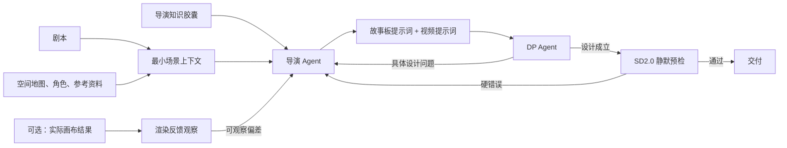

# MODE:P Loop 重构工程方案

> **目标：** 将 MODE:P 从“多 Agent 合规与打包流水线”重构为以导演为中心的提示词设计系统。
> **模型底座：** 即梦 Seedance 2.0（SD2.0）画布模式。
> **非目标：** 不兼容 Seko 的 `@` 语法、参数卡、禁止块、渲染包和平台工作流。
> **依据：** 已核查 `dispatcher_v5.0.md`、核心 Agent 指令、EP13/EP14/EP15 产物、导演知识库、SD2.0 能力边界及 Token 溯源报告。

---

## 1. 重构判断

### 1.1 根因

旧系统的问题不是缺少运镜、构图、光影知识；问题是同一个导演决策被拆成：

```
机位 Agent -> 运镜 Agent -> 构图光影 Agent -> PLAN -> Prompt Composer
             -> YAML / KB ID / TIME_SKELETON / 审计报告 / 平台打包
```

这导致四个后果：

1. **跨域割裂：** 运镜起止构图、光源方向与可用机位、景别变化与剪辑节奏被拆给不同 Agent，必须再靠合并和审计修补。
2. **注意力转移：** Scene Designer 必须同时写设计、规则编号、YAML、时间骨架和下游字段，创作注意力被协议占用。
3. **重复消费：** EP13 设计报告有 51 处 KB ID 和 8 个 YAML 区块，最终台本均不直接消费；EP14 PLAN 的连续性清单和冲突日志同样不进入最终生成文本。
4. **验证反噬：** Token 溯源显示旧 EP14 S1 约 875K tokens，大量消耗来自重复加载、全量审计和可由确定性检查替代的工作。

### 1.2 重构原则

1. **导演是一位统一作者。** 机位、运镜、构图、光影、转场在同一导演上下文中决定，不拆成运行时专项设计 Agent。
2. **DP 是专业反证者。** DP 找出“拍不了、接不上、模型做不到”的问题，不重写导演的创作。
3. **知识用于判断，不用于举证。** KB 被转化为导演与 DP 的工作知识，不在输出中出现规则 ID、规则说明或合规声明。
4. **只保留模型硬边界。** SD2.0 的时长、人数、动作、文字、正向描述等是模型事实；Seko 格式不是。
5. **没有消费者的中间信息不产出。** 不生成 YAML、PLAN、TIME_SKELETON、审计报告、冲突日志或打包文件。

---

## 2. 目标系统



### 2.1 运行时角色

| 组件 | 类型 | 职责 | 不做什么 |
|---|---|---|---|
| 导演 Agent | LLM | 统一设计整场戏并直接写两份最终提示词 | 不输出 YAML、KB ID、审计、平台打包 |
| DP Agent | LLM | 以摄影指导视角反证空间、连续性、运动、构图、光影和 SD2.0 可执行性 | 不重做分镜，不输出结构化报告 |
| 最小场景上下文 | 确定性整理 | 合并剧本、空间事实、角色/道具/参考资料为单一输入 | 不判断美学，不调用 LLM |
| SD2.0 静默预检 | 确定性代码 | 拦截明确的模型硬错误 | 不评价美学，不输出 Gate 报告 |
| 渲染反馈观察 | 可选视觉审查 | 基于真实画布输出描述偏差，交回导演修订 | 不在渲染前虚构审计问题 |

### 2.2 为什么不再拆分运镜/构图/光影 Agent

以下关系需要在同一次导演判断中闭环：

- 推进的起幅与落幅分别是两张构图；先定运镜、后补构图会产生无意义运动。
- 主光方向限制可用机位；先定机位、后补光影会产生跳光。
- 景别变化决定剪辑力度；先定机位、后补转场会造成节奏不连贯。
- 演员调度、摄影机轨迹、场景障碍物必须在同一空间模型中同时判断。

因此，“对应领域 Agent”应理解为**导演与摄影指导两个真实岗位**，不是把摄影部门再拆成彼此无法共享直觉的流水线角色。

---

## 3. 知识库重组

### 3.1 三层知识输入

| 层级 | 内容 | 加载策略 |
|---|---|---|
| 导演核心 | 叙事优先、四域联动、空间/关系线、视觉强度、剪辑原则 | 每次导演/DP 调用内化 |
| 场景胶囊 | 对话、动作、悬疑、抒情、群像、跨空间等场景模式 | 按剧本内容确定性选择 1-2 个 |
| SD2.0 胶囊 | 模型硬上限、提示词顺序、身份漂移、提示词泄漏、可见性语言 | 每次导演/DP 调用内化 |

### 3.2 要从现有 KB 继承的能力

| 知识来源 | 新用途 |
|---|---|
| `导演手册_视觉叙事决策框架.md` | 导演核心：意图到镜头技法、场景模式、跨域联动、P0 边界 |
| `运镜思维_导演可用运动思维.md` | 运动动机、静动呼吸、轨迹、起止构图、空间可行性 |
| `04_构图思维_导演用.md` | 视觉重心、深度、负空间、权力关系、构图与剪辑联动 |
| `PERFORMANCE_KB.md` | 潜台词转为可见姿态、面部、手势和节奏 |
| `sd2_model_capability.md` | 模型硬边界和失败模式 |
| `sd2_storyboard_prompt_quality_standard.md` | 正向视觉语言、具体动作/光影写法、渲染失败修复原则 |

### 3.3 明确不继承的知识形态

- KB 规则 ID 和逐镜引用。
- 以审计为目的的 P0/P1/P2 表格。
- Seko 的 `@` 引用语法、五段式、禁止块、平台模型选择、渲染包结构。
- 完整 KB 全文加载；导演只接收核心手册、当前场景胶囊和 SD2.0 胶囊。

---

## 4. 双循环设计

### 4.1 Loop A：导演与 DP 的设计循环

```text
1. Director/draft
   剧本 -> 戏剧动作、情绪弧线、空间关系、视觉策略 -> 完整提示词

2. DP/review
   只指出具体问题：镜号 + 现象 + 原因 + 约束

3. Director/revise
   只修改问题镜及受影响的相邻镜；保留创作主导权

4. DP/confirm
   “没问题，可以交付” -> 进入静默预检
```

导演首稿必须先形成一个简短的**场景蓝图**，但蓝图与最终提示词在同一文档中，不构成独立 PLAN：

- 本场戏的戏剧动作和情绪弧线。
- 空间、角色、光源的可用事实。
- 视觉策略：镜头距离如何变化、光比/色温如何变化、剪辑节奏如何变化。
- 角色状态变化和跨镜关键道具。

随后直接逐镜写出导演台本。没有“先结构化再翻译”的 Prompt Composer 阶段。

### 4.2 DP 反馈边界

DP 使用自然语言，必须具体且可执行：

> “镜 4 的推进路径穿过桌边；这个房间只剩 1.5 米纵深。镜 6 的主光没有物理来源。镜 3 到镜 4 的人物移动方向翻转。其余成立。”

DP 不输出规则 ID、严重级别、表格、审计摘要或替代全案。若 DP 与导演围绕同一创意连续三轮无法达成一致，交给人类导演决定；不自动强制通过，也不扩展专家会诊。

### 4.3 Loop B：基于真实画布结果的修订

只有实际渲染结果出现偏差时启动：

```
画布结果/用户反馈 -> 观察到的偏差 -> Director/fix -> 仅重写问题镜 -> 重新渲染
```

问题只按可观察现象表达：身份漂移、动作形变、镜头运动失真、光源不成立、构图失焦、文字乱码。它替代旧 Render-Verifier 的报告、P-STATE 标签和 Deep Repair 多 Agent 回路。

---

## 5. SD2.0 最小技术护栏

保留为透明的零 LLM 检查，不生成报告，仅向导演返回镜号与原句：

1. 每段时长不超过 15 秒。
2. 画面正文不含负向指令词。
3. 画面正文不含抽象情绪标签或文学模糊词。
4. 同镜不要求三张以上清晰正脸。
5. 同镜不要求多个核心动作或可读画面文字。

不保留：Seko `@` 语法、禁止块、模型名、KB ID、参数卡完整性、TIME_SKELETON 同构、平台上传格位等旧 Gate 规则。

---

## 6. 旧模块去向矩阵

| 旧模块 | 新去向 | 理由 |
|---|---|---|
| Shot Architect | 移除，能力并入导演 | 机位与构图/光影/剪辑不能分开设计 |
| Movement Designer | 移除，能力并入导演 | 静态镜头不应被迫写辩护；运动起止是构图问题 |
| Composition Designer | 移除，能力并入导演 | 光源与机位、构图与转场必须联动 |
| Scene Designer | 改造成 Director Agent | 是现有系统中最接近统一导演角色的基础 |
| Storyboard Planner | 移除 | PLAN/TIME_SKELETON 只服务旧中间链 |
| Prompt Composer | 移除 | 导演直接写最终故事板和视频提示词 |
| Scene Auditor / SDA / SSA | 移除 | DP 进行专业审查；确定性问题交静默预检 |
| P-Verifier 多专家会诊 | 移除 | 不服务创作，成本与注意力占用过高 |
| Gate 0 | 缩减为 SD2.0 静默预检 | 保留模型硬边界，删除平台/格式规则 |
| Object Timeline | 并入场景蓝图的关键道具状态 | 仅在实际跨镜状态变化时保留 |
| Anchor Baseline | 并入最小场景上下文 | 角色、空间、光源锚点仍有价值，但无需独立 Agent |
| P-STATE / 蒸馏 | 改为可选离线知识维护 | 不在每次设计调用中加载；仅在渲染失败复现后更新 |
| Render Packager | 移除 | 用户明确不处理 Seko 平台要求 |
| Render Verifier | 改为可选渲染反馈观察 | 只在真实画布结果存在时使用 |
| F1-F7 复杂度路由 | 移除运行时 Agent 分流 | 复杂度只影响导演的镜头策略，不再决定 Agent 拓扑 |

---

## 7. 最终交付格式

### 7.1 故事板提示词

- 场景蓝图：空间、角色、情绪弧线、视觉基调。
- 逐镜：画面、运镜、构图、光影、转场。
- 画面仅描述可见内容；运镜不混入画面描述。

### 7.2 视频提示词

- 场景蓝图：角色锚点、空间锚点、色彩/光影策略。
- 逐镜：机位、景别、焦段、运镜、构图、光影、进入/离开方式。
- 逐秒或约 1 秒的画面变化、声音时机。
- 每段独立可渲染，且不超过 SD2.0 时长边界。

不包含：YAML、规则引用、审计结论、禁止清单、平台上传指令、Seko 标记、冗长设计依据。

---

## 8. 实施阶段

### Phase 1：建立新目录与边界

- 保留旧 MODE:P 文档只读。
- 新实现放在 `01_调度器/mode_p_v9/`，不要覆盖 `mode_p_v8_final` 草稿。
- 写入新 `README`、Loop Controller、Director Prompt、DP Prompt、SD2.0 静默预检规范。

### Phase 2：知识胶囊

- 从现有知识库提炼导演核心、对话/动作/悬疑/抒情场景胶囊、SD2.0 胶囊和表演胶囊。
- 每个胶囊只保留能改变导演决定的知识，不保留规则 ID 或审计文字。

### Phase 3：实现 Loop

- 输入整理 -> Director/draft -> DP/review -> Director/revise -> DP/confirm -> 预检 -> 交付。
- 修订只传递上一版提示词、DP 反馈和相关输入，不重载旧全链路文件。

### Phase 4：样本回归

使用现有 EP14 静态对话、EP13 实验室对话/揭示、EP15 多镜工作室场景，以及一个动作场景。

### Phase 5：渲染反馈接入

- 先人工描述实际偏差。
- 再决定是否需要独立视觉观察能力；不预先恢复旧 Render-Verifier。

---

## 9. 验收标准

1. 运行时只有 Director 与 DP 两个 LLM 角色；渲染反馈仅在真实结果存在时按需启动。
2. 最终交付物只有故事板提示词和视频提示词。
3. 最终提示词不含 YAML、KB ID、审计语言、Seko 格式或平台打包字段。
4. 导演每镜同时做出机位、运镜、构图、光影、转场决定，并能体现剧本中的戏剧动作。
5. DP 反馈能够发现空间、轴线、视线、动作方向、光源、运镜与 SD2.0 的问题，但不重写导演创意。
6. SD2.0 硬错误在交付前被静默预检发现。
7. 用 EP13/14/15 回归时，所有保留的角色/空间/关键道具状态仍连续，且不再产生无消费者的中间文件。

---

## 10. 当前建议

先批准本方案的角色边界与模块去向，再开始 Phase 1。尤其需要确认：

- 最终是否接受“Director + DP + 静默预检”的运行时边界；
- 是否将跨场景角色/道具状态仅保留为场景蓝图中的简短状态，而不恢复独立 Anchor/Object Agent；
- 是否把渲染反馈保留为第二阶段功能，而不是第一版阻塞条件。
