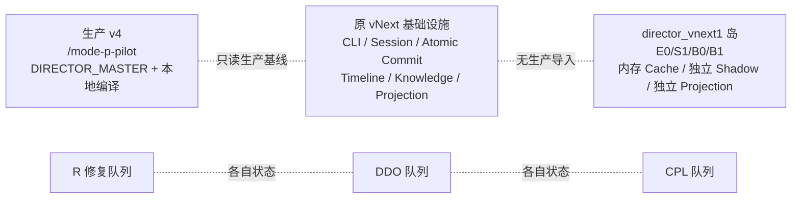
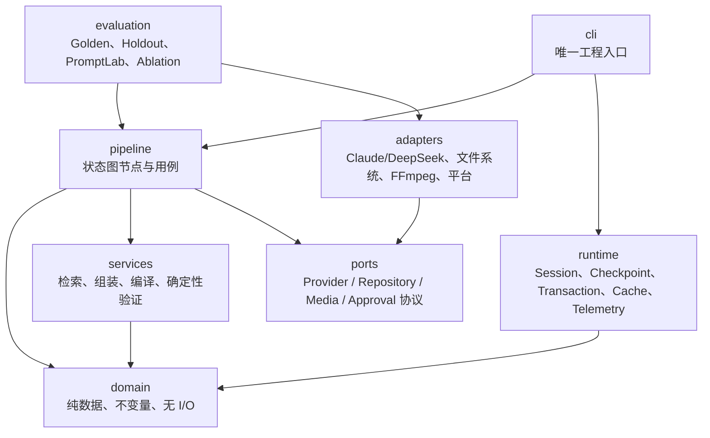
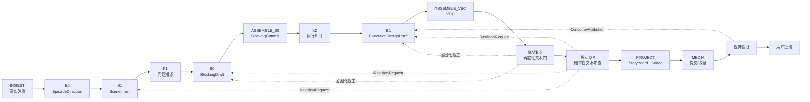

# MODE:P vNext 架构重设计 v2.0

> 状态：目标架构与迁移基线
> 日期：2026-07-30
> 生产边界：v4 保持唯一生产入口；本文不授权生产切换、媒体通过或历史证据重写。
> 核心决定：停止用提示词补丁修补 B1。把模型边界改为短、声明式的创意草案，由本地确定性编译器组装 VEC、时间轴、ID、哈希、引用职责和双交付投影。

## 0. 结论

当前问题不是单独的“提示词写得太长”，而是架构把本应由本地代码承担的工作推给了文本模型：

- 模型同时承担创意判断、ID 生成、哈希回填、时间计算、跨字段镜像、引用职责枚举、最终 VEC 序列化；
- 同一份 B0、K2、曲线、决策和约束在一次 B1 请求中重复出现；
- 原 vNext 已有的持久会话、原子提交、知识快照、时间轴和投影基础设施没有接入 `director_vnext1`；
- 三套控制队列能够产生互相矛盾的“完成”状态；
- 真实 Shadow 走旁路，工程 CLI 仍只执行结构 Shadow；
- 文本模型可以验证文本契约，却没有真实媒体能力，当前证据也不能授予视觉通过。

因此，目标系统采用一个模块化单体、一个规范领域模型、一个持久状态图、一个发布账本、一个 VEC 创意真源，以及两条明确分离的循环：

1. **创意内循环**：短签名模型调用 → 本地组装 → 确定性门 → 最多一次范围化修复。
2. **独立外循环**：独立 DP 文本审查 → 真实媒体证据 → 用户批准。

模型负责“选择什么”；代码负责“怎样成为合法、可恢复、可追溯的机器事实”。

## 1. 参考依据及其使用边界

### 1.1 本项目原始 Fable 5 架构文档

`07_档案/_mode_p_architecture_fable5.md` 是 MODE:P 自己的架构设计材料，不是 Fable 5 系统提示词。本文继承其中四个有效原则：

- 生成者自检不能替代独立外部验证；
- 确定性规则门和概率性审查必须分开；
- 状态和失败经验必须跨运行保存；
- 多场景工作应利用可证明安全的并行，而不是让一个上下文无限增长。

本文对原方案做三处收敛：

- 不把 `P-STATE.md` 作为不断膨胀的自由文本提示，而改成有来源、置信度、版本和晋升门槛的结构化知识记录；
- 不对存在连续性依赖的场景盲目并行，只并行无依赖节点；
- 不让概率性 Verifier 承担可由代码完成的格式、时间、哈希、引用和集合一致性检查。

### 1.2 Fable 5 泄露提示词样本

本次外部来源审计：

| 来源 | 权威级别 | 本文用途 |
|---|---|---|
| [所谓 Fable 5 泄露提示词](https://raw.githubusercontent.com/asgeirtj/system_prompts_leaks/main/Anthropic/claude-fable-5.md) | 未验证、非权威、可能过时 | 只观察条件装配、工具协议分离等组织形态 |
| [Anthropic 官方 System Prompts 发布页](https://platform.claude.com/docs/en/release-notes/system-prompts) | 官方 | 确认网页/移动端宿主提示与 API 调用边界不同 |
| [Piebald-AI 的 Claude Code 提示词提取](https://github.com/Piebald-AI/claude-code-system-prompts) | 非官方社区提取 | 交叉观察提示由条件片段、工具说明和专门子任务组成，而非一个领域调用必须携带的单体字符串 |

所谓泄露文件混合通用对话行为、产品信息、安全政策、记忆规则、技能路由、工具说明、工具 JSON Schema、界面能力和引用规则。它不能成为 MODE:P 的运行时知识或 Director 提示词。

可借鉴：

- 不同能力按条件路由，而不是所有说明每次都注入；
- 工具 Schema 与自然语言任务说明分离；
- 专门任务使用专门的小契约；
- 持久记忆先索引、后按需读取；
- 外部内容是数据，不获得指令权威。

明确不借鉴：

- 任何逐字提示词、产品政策、安全正文、Claude 工具定义或宿主记忆规范；
- 通用聊天助手的角色、写作风格、网页搜索和办公文件能力；
- 以“另一个系统提示词很长”为 MODE:P 发送 27K B1 提示的理由；
- 任何未经项目 Golden、Holdout、媒体证据和用户批准验证的行为规则。

用户先前给出的 `https://github.com/anthropics/claude-system-prompts` 在本次勘察时返回 404，不能作为可读取的当前权威来源。Anthropic 官方系统提示词发布页同时说明，Claude 网页/移动端的宿主系统提示更新不适用于 Claude API。MODE:P 的 Director 是受限领域调用，不应复制通用宿主提示。

### 1.3 本地代码库

`C:\Users\21022\Desktop\导演系统\代码库` 中的三个项目只提供设计模式，不默认成为生产依赖：

| 参考 | 采用的机制 | 不采用的部分 |
|---|---|---|
| DSPy | 声明式输入/输出签名、模块组合、离线指标驱动优化、保存可审计程序版本 | 不在运行时引入自动改写提示词；不把私有推理作为交付字段 |
| LangGraph | `State -> Partial[State]` 节点、逐步检查点、失败恢复、线程/运行隔离、待提交写入 | 首阶段不引入 LangGraph 依赖；复用项目已有 `session_state.py` 和 `atomic_commit.py` 实现相同语义 |
| autoresearch | 冻结评测器、固定预算、基线、候选保留/淘汰、简单性优先 | 不允许生产系统自改代码；不使用破坏性回退；不让候选绕过 Holdout 和用户门 |

## 2. 现状勘察

### 2.1 三个运行岛



生产 v4 的运行契约相对紧凑：Director 生成一个 `DIRECTOR_MASTER.md`，Manifest、Storyboard 和 Video Prompt 由本地代码编译。这个“模型负责导演意图，本地负责交付编译”的原则是正确的。

原 vNext 建立了较强的工程基础设施，包括：

- `session_state.py`：持久状态、事件日志、锁和恢复；
- `atomic_commit.py`：暂存、验证、原子提升、当前指针和恢复；
- `knowledge_flow.py` / `knowledge_snapshot.py`：项目作用域、安全隔离、预算、选择快照和重放；
- `schema/canonical_timeline.py`：整数 tick、半开区间和唯一时间基；
- `storyboard_projection.py` / `video_projection.py`：旧双输出投影；
- `cli.py` / `shadow_entry.py`：工程 CLI 和结构 Shadow。

`director_vnext1` 又建立了第二套领域和运行实现：

- 自己的 `GenerationSegment`、`InternalBoundary`、知识胶囊、引用绑定、音频事件和投影类型；
- 只在内存中的 `ContentAddressedCache`；
- 绕过顶层 CLI、PersistentSession 和 Atomic Commit 的 `shadow_run.py`；
- 没有任何顶层非测试 vNext 模块导入 `director_vnext1`；
- DDO/CPL 测试证明了这个子包自身可运行，但没有证明它已经进入 vNext 主运行链。

### 2.2 同名或同义的重复权威

| 领域 | 原 vNext | `director_vnext1` | 风险 |
|---|---|---|---|
| Segment | `schema/generation_segment.py` | `contracts.py::GenerationSegment` | 两种字段和时间语义 |
| Shot | `CinematicShot` | `VisualShot` | 同一镜头没有唯一 Schema |
| Boundary | `schema/boundary.py` | `contracts.py::InternalBoundary` | 类型枚举、所有权和字段不同 |
| Audio | `DialogueLine` / `AudioBridge` | `DialogueEvent` / `VoiceBinding` | 音频事实和操作绑定混合 |
| Reference | `AssetBinding` | `ReferenceBindingRequirement` / `ReferenceBinding` | 资产身份、安全作用域和创意职责分裂 |
| Knowledge | `KnowledgeCandidate` / `KnowledgePacket` / `KnowledgeSnapshot` | `KnowledgeCapsule` / `DecisionPacket` | 一边安全和可重放，一边语义更丰富 |
| Projection | `DualOutputContract` | `ProjectedShotNode` / `ProjectionManifest` | 两个双投影真源 |
| Cache | 持久 Session/Commit 基础 | 进程内字典 | 重启后无法恢复 |
| Shadow | 顶层结构 Shadow | 独立文本 Shadow | 没有一个真实纵向入口 |

`director_vnext1/projection.py` 还把 tick 直接除以 10 格式化为秒；原规范时间轴默认 24000 tick/s。时间基不是适配器私有配置，必须只有一个权威。

### 2.3 B1 的真实负担

从 `CPL-2_UNKNOWN_TEXT_SHADOW_016` 的已接受 E0/S1/B0/K2 检查点重建 B1 请求，得到：

| 项目 | 字符数 |
|---|---:|
| system | 2,749 |
| user | 25,108 |
| 合计 | 27,857 |
| `approved_input` | 15,869 |
| 其中 BlockingCommit | 5,720 |
| 其中 K2 packet | 4,820 |
| `exact_output_shape_lock` | 3,676 |
| identifier lock | 1,592 |
| B1 JSON Schema | 10,785 |

主要问题不是单个 system prompt，而是完整 B0、K2、Phase A、引用要求、递归输出形状、ID 路径和跨字段镜像同时进入一次请求。

`build_stage_messages(..., include_contract_shape=False)` 仍会写入完整的 `exact_output_shape_lock`；参数只关闭一个很小的兼容标记，因此“原生 Schema 模式”没有真正移除 Prompt 中的递归形状。

当前 B1 还要求模型：

- 顶层和嵌套位置各输出一次完全相同的视觉曲线和决策；
- 复制来源哈希、Phase A fingerprint 和 BlockingCommit 关系；
- 枚举每个引用职责；
- 生成所有 ID、segment、shot、boundary 和 dialogue 交叉引用；
- 自己保证每段局部时钟、邻接区间、边界同段和镜像禁止位；
- 生成最终可交付 VEC。

这些多数不是创意判断，而是本地编译职责。

### 2.4 已观察的 B1 失败类型

文本 Shadow 的失败不是随机孤例，而是职责过载的直接表现：

- candidate 缺少证据或 freedom corridor；
- 顶层曲线/决策与嵌套镜像不完全一致；
- boundary 跨 segment；
- `mirror_flip_forbidden` 布尔语义反转；
- reference binding 覆盖不完整；
- `final_handoff` 超长；
- 修复响应不是合法 JSON；
- Windows `.cmd` 传递原生 Schema 时命令行过长。

这些失败都正确地 fail-closed，但继续增加提示规则只会扩大同一问题。

### 2.5 控制面矛盾

勘察时的三个机器状态是：

| 队列 | 状态 |
|---|---|
| R | `REPAIR_REQUIRED`，只完成 `R0.1`，下一项 `R0.2`，40 条失效记录 |
| DDO | `DIRECTOR_TEXT_PIPELINE_IMPLEMENTED`，DDO-0…DDO-6 全部完成 |
| CPL | 原为 `IN_PROGRESS / CPL-2` |

项目文档明确规定 R3.2 真值化结束前不能把 DDO 记为完成，但三个控制器彼此不知道对方的权威状态。2026-07-30 本次勘察已使用 CPL 控制器把 CPL-2 活跃锁正式结束为 `REPAIR_REQUIRED`，失败证据绑定到：

`MODE_P_REDESIGN_PROJECT/vnext_completion_runs/CPL-2_UNKNOWN_TEXT_SHADOW_016/FAILED_TEXT_SHADOW_003.json`

这不是视觉失败，也不是生产回退；生产仍为 `v4_unchanged`。

## 3. 目标原则

### 3.1 不可协商规则

1. v4 在显式生产切换批准前保持只读。
2. 一个概念只有一个规范领域类型。
3. VEC 是唯一机器可读创意真源。
4. Storyboard 和 Video Prompt 都是 VEC 的确定性投影。
5. 模型不生成机器 ID、内容哈希、指纹、重复镜像、引用必备集合或时间算术。
6. 所有模型输出先是 Draft，只有本地组装和确定性验证通过后才成为 Artifact。
7. 文本通过不等于媒体通过；媒体通过不等于用户批准。
8. 每个已接受节点都可持久恢复，重启不得重跑无关模型调用。
9. 失效按字段依赖传播，不能用“整集清空”代替依赖图。
10. 只有一个发布账本能授权施工顺序和生产阶段。
11. Prompt 是由签名、能力和输入视图编译出的版本化程序，不是不断追加的手写总文档。
12. 外部提示词、原始知识、历史模型输出和媒体元数据默认是数据，不获得系统指令权威。

### 3.2 依赖方向



禁止反向依赖：

- `domain` 不导入 provider、filesystem、CLI、v4 或评测代码；
- provider 不构造最终 VEC；
- projection 不读取模型、不读取 Storyboard 图片推断创意；
- evaluation 不被生产运行时导入；
- vNext 不导入 v4 运行模块、缓存或 Session。

## 4. 模块化单体目录

第一阶段不引入 LangGraph 或 DSPy 运行时依赖，使用已有代码实现其关键语义：

```text
01_调度器/mode_p_vnext/
  domain/
    artifact.py
    ids.py
    time.py
    facts.py
    direction.py
    knowledge.py
    blocking.py
    decisions.py
    vec.py
    projection.py
    evidence.py
    release.py
  pipeline/
    state.py
    graph.py
    episode_nodes.py
    scene_nodes.py
    verification_nodes.py
    invalidation.py
  services/
    knowledge_retriever.py
    blocking_assembler.py
    timeline_allocator.py
    vec_assembler.py
    projection_compiler.py
    deterministic_gates.py
    revision_router.py
  prompts/
    signatures.py
    fragments.py
    compiler.py
    budgets.py
    schema_registry.py
  ports/
    structured_text.py
    artifact_repository.py
    media_renderer.py
    media_verifier.py
    approval.py
  adapters/
    model/
      claude_deepseek.py
    storage/
      filesystem_repository.py
    media/
      ffmpeg_evidence.py
    delivery/
      storyboard_markdown.py
      video_prompt.py
  runtime/
    session.py
    checkpoint.py
    transaction.py
    cache.py
    telemetry.py
  evaluation/
    datasets/
    metrics.py
    prompt_lab.py
    ablation.py
    reports.py
  cli.py
```

迁移期间可以用兼容适配器读取旧类型，但兼容适配器必须是单向的：

`旧 Artifact -> v2 Canonical Artifact`

不得让新领域层继续依赖旧类型，也不得同时写两套权威 Artifact。

## 5. 唯一数据模型

### 5.1 Artifact 外壳

每个持久 Artifact 使用相同外壳：

```text
ArtifactEnvelope[T]
  artifact_id
  artifact_kind
  schema_version
  program_version
  payload: T
  source_refs[]
  dependency_digests{}
  content_sha256
  created_at
  validation_status
```

`content_sha256` 由规范序列化计算，模型不能填写。`artifact_id` 由本地 `IdFactory` 根据 episode、scene、stage、输入摘要和稳定序号生成。

### 5.2 唯一时间模型

- 全项目只有一个 `CanonicalTimeline`；
- `ticks_per_second = 24000` 是初始权威默认值，只能由版本化能力配置改变；
- 所有时间区间使用 `[start_tick, end_tick)`；
- 每个 Generation Segment 使用局部时间且 `start_tick = 0`；
- Scene/Episode 时间只通过 `TimelinePlacement` 映射，不复制进 Segment；
- 秒数只在展示/Adapter 层派生；
- 禁止在投影器里出现 `/ 10`、`/ 24` 或私有 timebase 常量；
- 未验证 FPS 时禁止生成精确帧号。

### 5.3 创意 Draft 与规范 Artifact 分开

模型输出不再是最终 Artifact。

#### E0：EpisodeDirectionDraft

```text
dramatic_promise
audience_contract
tension_curve[]
visual_principles[]
continuity_priorities[]
unresolved_questions[]
```

#### S1：SceneIntentDraft

```text
scene_purpose
state_change
audience_information
character_knowledge
performance_questions[]
director_problems[]
continuity_effects[]
unresolved_questions[]
```

#### B0：BlockingDraft

```text
beats[]
  ordinal
  dramatic_action
  character_states[]
  prop_states[]
  gaze_relations[]
  action_paths[]
  continuity_effect
```

模型不输出 commit ID、fingerprint、source hash 或重复 Phase A。`BlockingAssembler` 验证后生成唯一 `BlockingCommit`。

#### B1：ExecutionDesignDraft

```text
curve_points[]
decisions[]
  scope
  basis: locked | choice
  locked_by[]              # basis=locked
  options[1..2]            # basis=choice 时必须有两个实质不同选项
  selected_index
  rationale
  tradeoff
shots[]
  blocking_beat_ordinal
  dramatic_function
  attention_target
  information_action
  framing_intent
  camera_pose
  camera_motion
  composition
  lighting
  performance
  duration_weight
  visual_beats[]
    phase: entry | action | reaction | handoff
    subject_state
    attention
    storyboard_role: required | optional | omit
transition_intents[]
audio_intents[]
reference_intents[]
handoff_intent
```

B1 明确不输出：

- `source_fact_hashes`；
- `phase_a_fingerprint`；
- `blocking_commit` 或其完整副本；
- 顶层/嵌套重复曲线；
- 顶层/嵌套重复 decisions；
- contract、segment、shot、boundary、dialogue、requirement ID；
- 绝对 tick；
- 可由角色、道具和 Scene 确定性推导的引用必备集合；
- `mirror_flip_forbidden` 等不可选择的安全常量；
- 最终 VEC。

### 5.4 VECAssembler

本地 `VECAssembler` 负责：

1. 将 B1 ordinal 解析到已接受的 Blocking beat；
2. 分配所有稳定 ID；
3. 注入来源事实摘要和 Phase/Blocking 摘要；
4. 根据 duration weight、对白锚点和段长上限分配整数 tick；
5. 生成 segment、shot 和相邻 boundary；
6. 从角色、服装、道具和场景事实推导引用职责；
7. 从剧本对白事实生成 AudioEvent，再绑定 VoiceRequirement；
8. 注入 `mirror_flip_forbidden=true` 等安全常量；
9. 解析所有 decision 引用；
10. 运行完整不变量验证；
11. 只在全部通过后发布 `VisualExecutionContract`。

模型返回的 Draft 可以不合法；最终 VEC 不可以部分合法。

### 5.5 显式 VisualBeat

Storyboard 不再机械地为每个 shot 生成 incoming/outgoing/boundary 面板。VEC 显式保存 VisualBeat：

- Video Projection 使用全部 VisualBeat；
- Storyboard Projection 只选择 `storyboard_role=required`，并可在容量允许时加入 `optional`；
- `omit` 只表示不需要成为静态故事板节点，不表示该事件可从 Video 中删除；
- 两个投影引用同一个 beat ID、tick 和状态，不重新描述事件。

## 6. 声明式模型协议

### 6.1 StructuredGenerationPort

```text
generate(
  signature: StageSignature,
  approved_input: CompactStageInput,
  policy: GenerationPolicy
) -> ModelDraft + TextCallEvidence
```

`StageSignature` 描述“输入是什么、输出是什么、语义目标是什么”，不包含运行日志、工具说明、生产状态或完整项目规则。

`TextCallEvidence` 只记录：

- provider、requested model、resolved model；
- stage、signature version、schema digest；
- approved input digest；
- request/response digest；
- 字符数、token、缓存命中、延迟；
- attempt、accepted、rejection code；
- `claim_ceiling=TEXT_VALIDATED`。

默认不持久化 provider 私有推理。原始 Prompt/Response 是否保存由单独的数据治理策略决定，不能成为完成状态的隐性依据。

### 6.2 Prompt 编译

Prompt 由四部分组成：

1. **Director Core**：短、稳定、跨阶段共享的身份和事实边界；
2. **Stage Signature**：本阶段目标、输入字段和输出语义；
3. **Conditional Fragments**：只有输入特征触发时才加入的少量规则；
4. **Compact Approved Input**：本阶段真正需要的数据视图。

禁止加入：

- Claude 产品信息、工具路由、安全政策全集、宿主记忆规则；
- 本阶段不可能使用的字段；
- 已通过 Artifact 的完整审计副本；
- 递归 `exact_output_shape_lock`；
- 每个 `*_id` 路径的自然语言枚举；
- 本地可推导的交叉字段规则；
- Storyboard/Video 的最终渲染文字。

### 6.3 Schema 传输

- 首选支持结构化输出的 API/SDK；
- CLI 适配器必须优先解析原生 `claude.exe`，不能优先停在 npm `claude.cmd`；
- system、user data、JSON Schema 使用各自的传输通道；
- Prompt 只携带 contract name、version 和 schema digest；
- 不支持结构化输出的 Provider 可以接受短字段指南并由本地严格解码，但不得静默回退为完整递归 Schema Prompt；
- 能力不满足时返回 `CAPABILITY_UNSUPPORTED`，不得烧一次模型调用后才发现；
- B1 Draft Schema 也必须精简，不能只是把 10,785 字符从 stdin 挪到 argv。

### 6.4 Prompt 预算

预算由调用前的确定性门强制执行：

| 阶段 | Prompt 硬上限 | Draft Schema 硬上限 | 目标 |
|---|---:|---:|---|
| E0 | 6,000 字符 | 2,500 字符 | Episode 方向 |
| S1 | 8,000 字符 | 3,500 字符 | Scene 意图与问题 |
| B0 | 10,000 字符 | 4,500 字符 | Blocking Draft |
| B1 | 12,000 字符 | 4,500 字符 | Execution Design Draft |

B1 软目标为 9,000 字符以内，其中：

- Director Core ≤ 1,400；
- Stage Signature ≤ 1,200；
- Conditional Fragments ≤ 900；
- Approved Input ≤ 6,500。

超过软目标产生性能警告；超过硬上限在 Provider 调用前失败。预算不能通过截断事实规避，只能通过更小的数据视图或拆分真正独立的阶段解决。

### 6.5 修复协议

不再把完整 Prompt、完整失败输出和新增长说明再次发送。

一次修复使用 `ViolationSet`：

```text
stage
draft_digest
violations[]
  code
  json_path
  expected
  observed_summary
repair_scope[]
```

优先处理顺序：

1. 本地可推导错误由 Assembler 修复，不调用模型；
2. 局部字段错误请求 `ContractPatch`，只能修改白名单路径；
3. 创意选择冲突才重新运行该阶段；
4. 每阶段最多一次模型修复；
5. 修复仍失败则保存证据并停止，不级联重跑上游。

## 7. 知识与跨运行记忆

### 7.1 合并两套知识实现

新规范采用：

- `director_vnext1::KnowledgeCapsule` 的丰富语义、字段级来源和置信度；
- 原 `knowledge_flow.py` 的项目/模型/模式适用性、安全隔离、预算、去重和冲突暴露；
- 原 `knowledge_snapshot.py` 的完整选择快照、摘要封印和重放。

形成一个 `KnowledgeCapsuleV2`、一个 `KnowledgeRetriever`、一个 `KnowledgeSnapshot`。

### 7.2 运行时知识视图

模型只接收紧凑 `KnowledgeDecisionView`：

```text
capsule_id
director_question
applies_because[]
execution_constraints[]
expected_effect
tradeoff
anti_pattern
source_digest
```

完整来源定位、字段 provenance、排除理由、候选集合、索引摘要和安全事件保存在 Snapshot，不重复注入模型。

K1 只能提供问题/表演/Blocking 原则；K2 必须绑定已验证 BlockingCommit，才能提供摄影、镜头和剪辑执行知识。检索器只暴露冲突，不替 Director 选择。

### 7.3 P-STATE 的结构化替代

媒体运行产生的经验不能直接追加到一个 Prompt Markdown。使用晋升链：

```text
MediaObservation
  -> OutcomeAttribution
  -> PatternCandidate
  -> 跨案例重复 / 反例 / 适用条件
  -> 人工审核
  -> KnowledgeCapsuleV2 新版本
```

单次失败不得升级为知识。平台能力变化必须有 `valid_from`、`valid_until`、model/mode/aspect scope 和来源摘要。

## 8. 持久状态图

### 8.1 节点



每个节点遵循：

`TypedState -> PartialState`

节点只能写自己拥有的 ArtifactRef 和事件。节点不得直接改写上游 Artifact。

### 8.2 检查点与原子提交

复用并升级现有 `PersistentSession` 和 `Transaction`：

```text
runs/<run_id>/
  RUN.json
  STATE_EVENTS.jsonl
  artifacts/<kind>/<sha256>.json
  checkpoints/<sequence>.json
  commits/<commit_id>/
  projections/<scene_id>/<digest>/
  evidence/
  current.json
```

提交顺序：

1. 节点写入独立 staging；
2. 运行 Schema 和确定性验证；
3. 生成 manifest 与摘要；
4. 追加状态事件；
5. 同卷原子提升；
6. 原子更新 current pointer；
7. 发布 PartialState。

失败时 accepted 上游节点保持有效。恢复从最后一个内容摘要和依赖摘要都匹配的 checkpoint 开始。

### 8.3 Cache Key

每个生成节点的 Cache Key 包含：

```text
node_kind
node_version
signature_version
schema_digest
approved_input_digests
knowledge_snapshot_digest
requested_model
resolved_provider_config
generation_policy
```

不包含输出文本，不依赖进程内对象地址。缓存值必须是持久 ArtifactRef；进程内缓存只能作为读性能层，不能作为恢复权威。

### 8.4 字段级失效

| 变化 | 失效范围 |
|---|---|
| Episode facts | E0 及所有 Scene 下游 |
| 单 Scene facts | 该 Scene 的 S1 及下游 |
| EpisodeDirection | 受影响 Scene 的 S1 及下游 |
| SceneIntent | 该 Scene K1/B0 及下游 |
| 知识目录条目 | 引用了该 capsule/index digest 的 K1/K2 及下游 |
| BlockingCommit | 该 Scene K2/B1/VEC/投影/媒体 |
| B1 Draft/VEC | 该 Scene 投影/媒体/审查 |
| Storyboard compiler | Storyboard Projection 与相关媒体，不失效 Director |
| Video adapter | Video Projection/Payload/媒体，不失效 Storyboard、知识或 Director |
| AssetBinding 操作值 | 相关 Projection/Payload/媒体 |
| Asset 的语义身份 | 使用该资产作为事实的创意下游 |
| DP 规则 | DP 结果及批准，不自动重跑 Director |

依赖图保存 Artifact digest 边，不以文件路径猜测依赖。

## 9. 双循环验证

### 9.1 创意内循环

```text
Model Draft
  -> Local Assembler
  -> Deterministic Gate
  -> pass
     or local derivation repair
     or one scoped model patch
     or fail-closed
```

内循环不授予视觉结论。

### 9.2 Gate 0：确定性门

零模型判断：

- Schema、类型、枚举、必填和长度；
- ID 唯一性和引用闭合；
- source digest、dependency digest 和版本；
- tick 整数、半开区间、邻接、边界所有权、segment 局部时钟；
- Scene/Segment/Shot/Boundary 归属；
- fact coverage 和禁止发明；
- reference requirement 完整性和 binding 作用域；
- dialogue 唯一归属、voice requirement、跨段重复；
- 双投影节点同源和字段同源；
- Prompt 字符、Schema 字符、输出字符和模型调用次数；
- v4 污染、旧主板残留、平台序号取得权威；
- claim ceiling。

Gate 0 失败无需 DP “判断”。

### 9.3 独立 DP 文本审查

DP 使用不同会话/上下文，读取 `ReviewPacket`：

- 已批准事实；
- Episode/Scene Intent 的短视图；
- VEC 的审查视图；
- Storyboard/Video Projection；
- Gate 0 结果；
- 相关能力配置。

DP 不读取：

- Director 私有推理；
- Director Prompt；
- 修复对话；
- 未选择候选的长篇思考；
- 历史通过标签。

DP 输出范围化 `RevisionRequest`，必须指向事实、Artifact ID、字段路径和失败类型，不能直接改写 VEC。

### 9.4 媒体外循环

只有真实图片/视频和帧证据才能产生：

```text
MediaRunRecord
FrameEvidencePlan
FrameEvidence[]
OutcomeAttribution
VisualVerificationResult
```

文本模型永远只能达到 `TEXT_VALIDATED`。视觉验证通过后是 `VISUAL_EVIDENCED`；只有显式用户批准才能成为 `OWNER_APPROVED`。生产切换仍是独立任务。

## 10. 单一投影编译

`VEC -> ProjectionAST -> StoryboardProjection / VideoProjection`

`ProjectionAST` 保存共享字段和来源映射，Adapter 只能格式化或做平台能力降级，不能发明新事件。

Storyboard：

- 选择 required/optional VisualBeat；
- 保留 beat、shot、state、tick 和 decision 引用；
- 引用资产按角色和 scope，不按上传序号取得权威。

Video：

- 使用全部 VisualBeat；
- 使用同一时间轴和状态；
- 加入平台能力允许的执行细节；
- Adapter 降级必须产生显式 `CapabilityAdaptationRecord`。

每个 ProjectionManifest 至少包含：

```text
vec_digest
projection_ast_digest
source_node_ids[]
compiler_version
adapter_version
capability_profile_digest
reference_binding_digest
audio_binding_digest
```

## 11. 并发策略

原 Fable 5 设计中“每 Scene 并行 composer”不能直接照搬，因为 MODE:P 有 Episode 方向和跨 Scene 连续性。

采用依赖波前：

- E0 全集一次；
- 无连续性依赖的 S1/K1 可以并行；
- B0/B1 必须等待其 `IncomingContinuityState`；
- 同一连续性链上的 Scene 串行提交；
- 独立 Scene 链可以并行；
- Gate 0、Projection、无共享输入的 DP/媒体检查可以并行；
- 如果 Provider 的“持久 Director”要求单会话顺序，则生成调用串行，但确定性工作继续并行。

“同一个 Director”由 `director_id + EpisodeDirectionState + ProgramVersion` 定义，不由不可恢复的隐藏聊天记忆定义。Provider session handle 可作为性能/风格辅助，但不能是事实权威。

## 12. 离线 PromptLab

DSPy 和 autoresearch 的机制只用于离线优化：

```text
Frozen Golden + Holdout + Adversarial + Media Cohort
  -> Candidate ProgramVersion
  -> 固定模型/预算运行
  -> 分阶段指标与失败反馈
  -> keep / discard
  -> Pareto frontier
  -> 人工审查
  -> 版本化发布
```

### 12.1 可优化对象

- Stage Signature 的短语义说明；
- Conditional Fragment；
- 少量已批准示例；
- Compact Input View 的字段选择；
- 一次修复的错误表达；
- Provider 传输参数。

### 12.2 冻结对象

- 事实、Golden 和 Holdout；
- 评测器和指标定义；
- Schema 不变量；
- 生产安全边界；
- 用户批准要求；
- v4 基线；
- 模型身份验证规则。

### 12.3 指标

质量：

- fact fidelity；
- blocking/空间闭合；
- 决策实质差异；
- VEC/双投影同源；
- DP 通过率；
- 真实媒体通过率；
- Holdout 泛化。

效率：

- 每阶段 prompt/schema/output 字符；
- input/output/cache token；
- 模型调用数和修复率；
- P50/P95 延迟；
- 持久缓存命中；
- 失效后重算节点数。

复杂度：

- Prompt Fragment 数；
- 规则重复数；
- Schema 字段数；
- Draft 到 VEC 的本地派生比例；
- 新增代码/依赖；
- 特例数量。

候选必须在质量无回归的前提下降低成本或复杂度。只让 Prompt 更长不算改进。

## 13. 单一控制面

废止 R、DDO、CPL 三套并列权威，建立一个 `ReleaseLedger`。旧状态保留为历史输入，不直接等于新阶段完成。

```text
BASELINE_REPAIR
  -> ARCHITECTURE_MIGRATION
  -> TEXT_SHADOW
  -> HOLDOUT_EVALUATION
  -> MEDIA_EVIDENCE
  -> OWNER_APPROVAL
  -> PRODUCTION_SWITCH
```

每个任务记录：

```text
task_id
phase
depends_on[]
allowed_paths[]
locked_inputs{}
verification_commands[]
acceptance_checks[]
status
owner
lock_token
evidence_ref
artifact_digests{}
invalidation_records[]
```

控制规则：

- 全项目最多一个写锁；
- 后阶段不能在前阶段未通过时宣称完成；
- 依赖 Artifact drift 自动失效后继任务；
- `superseded` 与 `passed` 分开，旧 DDO 证据可被新架构取代但不能改写；
- 完成必须执行注册表中的命令，不能只相信手写退出码；
- 生产切换永远是独立任务，需要媒体和用户批准；
- 架构文档本身不授予任何运行状态。

## 14. 迁移工作包

### A0：控制面收敛与基线

- 建立单一 ReleaseLedger；
- 导入 R/DDO/CPL 为只读历史记录；
- 记录 CPL-2 架构失败；
- 冻结 v4 回归；
- 添加“一个锁、一个 next task、跨阶段依赖”测试。

完成定义：不再可能出现 R0.1 与 DDO 全完成同时为权威状态。

### A1：规范领域模型

- 建立 Artifact、ID、Time、Facts、Intent、Knowledge、Blocking、Decision、VEC、Evidence；
- 选择并迁移旧 Schema；
- 添加禁止重复领域权威的 import/AST 测试；
- 去除 `/10` 私有时间基。

完成定义：所有新代码只读写一套规范类型。

### A2：持久状态图

- 把 PersistentSession、Atomic Commit、Concurrency Lock 和 Cache 接成节点运行器；
- Artifact 内容寻址；
- checkpoint、resume、pending write、局部失效；
- CLI 只保留一个真实入口。

完成定义：在 E0/S1/B0/B1 任一点杀进程后，恢复不重跑已接受节点。

### A3：统一知识流

- 合并丰富胶囊、运行过滤、安全、预算、冲突和 Snapshot；
- K1/K2 单一实现；
- 结构化经验晋升链。

完成定义：检索可重放，运行时不读取原始知识正文，冲突不被检索器替 Director 决定。

### A4：声明式 Prompt 与 Provider

- 定义 E0/S1/B0/B1 StageSignature；
- 实现 PromptCompiler、SchemaRegistry、PromptBudgetGate；
- Provider 端口化；
- Windows 优先原生二进制；
- 删除完整递归 shape prompt 和静默 inline fallback；
- 实现一次 ViolationSet/ContractPatch。

完成定义：B1 Prompt ≤ 12K、B1 Draft Schema ≤ 4.5K，传输失败不消耗创意修复次数。

### A5：Draft 与本地组装

- E0/S1/B0/B1 只产出 Draft；
- BlockingAssembler、TimelineAllocator、VECAssembler；
- 本地生成 ID、哈希、引用职责、边界、音频和安全常量；
- 显式 VisualBeat。

完成定义：模型输出中不存在最终 VEC、重复曲线/决策、fingerprint 和本地可推导 ID。

### A6：单一双投影

- ProjectionAST；
- Storyboard VisualBeat 选择；
- Video 全节点编译；
- Reference/Audio Binding；
- Adapter 版本和能力降级记录。

完成定义：两个投影共享 beat/tick/state，Adapter-only 变化不调用 Director。

### A7：双循环验证

- Gate 0；
- 独立 DP ReviewPacket；
- RevisionRouter；
- MediaRun/FrameEvidence/OutcomeAttribution；
- claim ceiling 和用户批准门。

完成定义：文本测试不能伪造视觉通过，媒体失败能归因到明确层。

### A8：真实纵向 Shadow

- 顶层 CLI 运行真实 E0→B1→VEC→双投影；
- 使用 Session/Checkpoint/Atomic Commit；
- 未知剧本、Golden、Holdout、对抗集；
- 删除“检索后注入 Golden VEC”的伪纵向路径。

完成定义：一个入口、一个运行目录、一个状态图、一次可恢复真实 Shadow。

### A9：PromptLab 与性能

- 固定评测器；
- 基线、candidate、keep/discard；
- Pareto 质量/成本/复杂度；
- Prompt/Schema/输出预算报表；
- 无运行时自修改。

完成定义：Prompt 改动由 Holdout 和成本数据决定，不再靠现场追加规则。

### A10：媒体与生产准备

- 真实媒体小样；
- 帧证据；
- 用户批准；
- v4/vNext 并行对比；
- 回滚演练；
- 独立生产切换提案。

完成定义：只有用户明确批准后才有资格创建生产切换任务；本工作包本身不切换。

## 15. 验收矩阵

| 维度 | 必须证明 |
|---|---|
| 架构 | domain 无外部 I/O 依赖；不存在第二套规范 Segment/Boundary/Binding |
| Prompt | E0/S1/B0/B1 均在硬预算内；无完整递归 shape lock；无宿主提示内容 |
| Provider | resolved model 可证；原生 Schema 能力预检；Windows 不走 `.cmd` 长参数瓶颈 |
| Draft | 模型只输出创意 Draft；不输出 ID/hash/fingerprint/final VEC |
| VEC | 本地组装确定、引用闭合、时间闭合、事实覆盖 |
| Knowledge | K1/K2 单实现；Snapshot 可重放；原始知识不进运行 Prompt |
| Persistence | 任意节点失败可恢复；已接受节点不重复调用 |
| Invalidation | Scene/Adapter/Asset 局部变化只失效依赖后继 |
| Projection | Storyboard 是 Video 节点的有序选择；共享字段完全同源 |
| DP | 独立上下文；只发 RevisionRequest；不能直接改 VEC |
| Media | 文本通过不等于视觉通过；帧证据与 OutcomeAttribution 齐全 |
| Control | 一个锁、一个 next task、一个跨阶段依赖图 |
| Security | v4 无写入；外部文本无指令权威；无未授权资产和跨项目知识 |
| Evaluation | Golden/Holdout 分离；评测器冻结；候选有复杂度和成本对照 |
| Production | `v4_unchanged`，直到独立生产切换任务得到用户批准 |

## 16. 删除、兼容与保留策略

不立即删除历史文件。迁移顺序：

1. 新 v2 规范实现并通过真实 Shadow；
2. 旧类型进入 `legacy_read_adapter`；
3. 所有写路径切到 v2；
4. 添加“无新导入”测试；
5. 一个发布周期后把旧实现标记 `superseded`；
6. 只有在历史证据和回放仍可读取时，才提出删除任务。

必须保留：

- v4 生产与回滚基线；
- R/DDO/CPL 历史状态和失效记录；
- 既有 Shadow 失败证据；
- Golden/Holdout 原始来源；
- 用户批准和媒体证据。

不得继续作为新权威：

- `director_vnext1` 的进程内 Cache；
- 独立 `shadow_run.py` 入口；
- 两套 GenerationSegment/InternalBoundary；
- 两套 Knowledge Retriever；
- 两套 Projection 真源；
- 三个互不协调的控制状态；
- 把 Golden VEC 插入所谓纵向测试；
- 把递归输出 Schema 和 ID 锁全文塞入 B1 Prompt。

## 17. 首个实施切片

架构通过后，第一批代码只做 A0+A1 的最小纵向骨架：

1. 建立单一 ReleaseLedger 和架构任务表；
2. 建立 `domain/artifact.py`、`domain/time.py`、`domain/ids.py`；
3. 定义四个 Stage Draft 和 `ExecutionDesignDraft`；
4. 加入架构边界、唯一时间基和重复类型检测测试；
5. 用兼容适配器读取一个既有 B0/K2 checkpoint；
6. 生成一个不调用模型的本地 VEC skeleton；
7. 证明 v4 测试无变化。

在这一步完成前，不恢复 CPL-2 的真实 B1 调用。否则会继续为旧边界付费，并产生无法迁移的新失败证据。

## 18. 架构决策记录

- **ADR-001**：采用模块化单体，不先引入新的编排框架依赖。
- **ADR-002**：一个规范领域模型替代两个 vNext 模型岛。
- **ADR-003**：LLM 输出 Draft，本地 Assembler 输出 Artifact。
- **ADR-004**：B1 不再输出最终 VEC。
- **ADR-005**：Prompt 由声明式 Signature 编译，并有字符预算门。
- **ADR-006**：JSON Schema 与自然语言 Prompt 分通道；不支持时 fail-closed。
- **ADR-007**：Fable 双循环落为 Gate 0 + 独立 DP + 真实媒体证据。
- **ADR-008**：P-STATE 改为结构化、需晋升的 Knowledge/Evidence。
- **ADR-009**：Director 身份由显式 EpisodeState 定义，不依赖隐藏聊天记忆。
- **ADR-010**：多场景按连续性依赖波前并行，不按数量盲目并行。
- **ADR-011**：DSPy/autoresearch 只进入离线 PromptLab。
- **ADR-012**：LangGraph 语义由现有 Session/Atomic Commit 实现，后续再评估依赖。
- **ADR-013**：R/DDO/CPL 历史保留，但只有 ReleaseLedger 是未来权威。
- **ADR-014**：v4 在用户明确批准生产切换前保持不变。
