# MODE:P vNext 架构 v3.0：导演主权、确定性编译与媒体证据双循环

> 状态：`NORMATIVE_SINGLE_AUTHORITY`
>
> 生效范围：MODE:P vNext 的 A0–A10 架构迁移、文本影子、评测与媒体验收
>
> 生产边界：`production_entry=v4_unchanged`；本文不授权生产切换
>
> 取代关系：v2.0、v2.1、v2.2、v2.3 仅保留为 `HISTORICAL_READ_ONLY`。它们不再叠加形成权威，也不能补充、覆盖或解释本文。

## 0. 结论与约束词

v3.0 是一次完整基线重建，不是给旧提示词追加规则，也不是给 v2.3 打补丁。系统只有一个创作权威 Director、一个规范领域模型、一个持久状态图、一个 VEC、一个 ProjectionAST 和一个 ReleaseLedger。模型只提交创作草案或审查请求；本地代码生成并验证 ID、哈希、时间、边界、绑定、投影与证据。

本文使用以下约束词：

- `MUST`：不满足即失败关闭，不得降级继续；
- `MUST NOT`：禁止路径；
- `SHOULD`：除非证据说明例外，否则必须执行；
- `MAY`：不影响权威边界的实现选择。

如施工方案、旧代码、测试或提示词与本文冲突，以本文为准。执行者 MUST 记录架构差异、失败当前任务、失效受影响的下游证据，并在重新锁定架构后从 ReleaseLedger 返回的唯一任务恢复；不得自行选择旧方案。

## 1. 根源分析与 v2.3 处置

### 1.1 全项目不变量

生产 v4 已证明以下产品语义必须保留：

1. 每场 `DIRECTOR_MASTER.md` 是唯一视觉设计源；Storyboard、Video Prompt 和 Shot Manifest 由本地程序派生。
2. Director 独占机位、运镜、构图、光影、表演、空间调度、镜间切换和生成模式的创作责任。
3. DP 是每轮全新、只读、独立的审查者，只能输出范围化 `RevisionRequest`，不能重做导演设计或直接修改 VEC。
4. `N` 个 Shot 只有 `N+1` 个共享 Boundary，顺序为 `B0 -> Shot1 -> B1 -> ... -> ShotN -> BN`。
5. 每个 Shot 是独立生成单元，且 `0 < duration <= 15s`；15 秒上限不作用于整场或一组镜头的合计时长。
6. Director/DP 的文本上下文不读取图片、视频或音频二进制；视觉通过必须来自独立的真实媒体证据链。

### 1.2 v2.3 为什么被拒绝

v2.3 被标记为 `REJECTED_BY_WHOLE_SYSTEM_AUDIT`，原因不是版本号，而是其契约改变了产品语义：

- 把一场强制压入一个恰好 15 秒的 GenerationSegment，违反“每镜不超过 15 秒”；
- 用源文本字符中点推导 `dialogue_anchor_ppm`，把 provenance/order 错当成导演时间；
- 没有把引用与音频需求绑定到具体 Shot/VisualBeat，无法证明需求在何处消费；
- 从全部场景事实自动生成引用/音频需求，夺走 Director 的选择责任并产生未使用资产；
- 要求 FactAssembler，却没有在 A5 之前提供合法实现所有者；
- 同时改变 schema、持久化、哈希、提示词和运行图，实质是主版本重建而非小修订。

因此 v3.0 明确禁止复用“整场 15 秒”“字符位置映射时间”“解析自由文本建立机器绑定”三条路径。

## 2. 权威层级与运行边界

权威从高到低为：

1. 本 v3.0 单一架构文档及其 ReleaseLedger 锁定哈希；
2. A0–A10 任务注册表与施工协议；
3. 当前任务的实现、测试和 Evidence；
4. 生产 v4 作为只读产品行为基线；
5. v2.x、R、DDO、CPL、V0–V10 和 `director_vnext1` 作为历史证据。

低层不得覆盖高层。历史实现 MAY 通过显式只读适配器提供迁移输入，但 MUST NOT：

- 成为 vNext 运行时的领域类型权威；
- 选择、认领或完成 A 任务；
- 启用 vNext 生产入口；
- 把旧提示词、旧 checkpoint 或旧完成记录当成 v3 合格证据。

在 A10 完成后，ReleaseLedger 的最高结论仍只是 `PRODUCTION_SWITCH_PROPOSAL_ELIGIBLE`。生产切换必须是独立的新决策，不属于 A0–A10。

## 3. 系统形态：导演内循环 + 媒体外循环

```mermaid
flowchart LR
    SRC["Episode Source"] --> I0["I0 FactExtractionDraft"]
    I0 --> FA["Local FactAssembler"]
    FA --> FR["FactRegistry"]
    FR --> E0["E0 Dramatic Analysis"]
    E0 --> S1["S1 Scene Direction"]
    S1 --> K1["K1 Knowledge Snapshot"]
    K1 --> B0["B0 Blocking Draft"]
    B0 --> BC["Local Blocking Compiler"]
    BC --> K2["K2 Shot Knowledge Snapshot"]
    K2 --> B1["B1 Shot Design Draft"]
    B1 --> VA["Local VEC Assembler"]
    VA --> G0["Deterministic Gate 0"]
    G0 --> DP["Fresh Independent DP"]
    DP -. "RevisionRequest" .-> S1
    DP -. "RevisionRequest" .-> B0
    DP -. "RevisionRequest" .-> B1
    DP --> PA["ProjectionAST"]
    PA --> SB["Storyboard Projection"]
    PA --> VP["Video Projection"]
    SB --> MR["Real Media Render"]
    VP --> MR
    MR --> MV["Media Verification"]
    MV -. "Media RevisionRequest" .-> S1
    MV -. "Media RevisionRequest" .-> B0
    MV -. "Media RevisionRequest" .-> B1
    MV --> UA["Owner Preview Approval"]
```



内循环终点是“文本和结构上可投影”，不是“视觉已通过”。外循环必须运行真实媒体、保存可复查的 frame/run evidence，并由用户明确批准预览。

## 4. 创作角色与责任

### 4.1 Director

Director 是唯一视觉设计者。Director MUST 选择场景调度、Shot 切分、每镜视觉节拍、参考职责、对白在镜头中的创作落点、时长意图和生成模式。Director 输出的都是 Draft，不得铸造持久 ID、哈希、绝对 tick 或文件路径。

### 4.2 DP

DP MUST 使用与 Director 隔离的新会话，只读取最小 `ReviewPacket`。DP MAY 引用事实句柄、Artifact ID 和字段路径，但只输出：

- `READY`；或
- `RevisionRequest(target_artifact, field_path, failure_type, observation, bounded_scope)`；或
- `DP_INPUT_BLOCKED(missing_input)`。

DP MUST NOT 读取 Director 私有推理、旧 DP 历史、运行时代码、知识库全文、缓存、遥测或媒体二进制；MUST NOT 写 VEC 或替 Director 选镜头。

### 4.3 本地编译器

本地编译器负责确定性工作：规范化、opaque handle/ID、canonical hash、24000 tick 时间、N+1 Boundary、引用与音频 requirement ID、Shot/Beat 绑定、Projection 节点和完整性验证。相同输入和相同 capability profile MUST 产生字节级规范等价的输出。

## 5. 单一领域与 Artifact 规则

### 5.1 唯一类型权威

持久类型只允许定义在 `mode_p_vnext.domain`。service、pipeline、adapter、prompt 和历史岛 MUST NOT 定义同名或语义等价的持久 dataclass。它们可定义非持久 DTO，但名称和边界必须明确。

所有持久 Artifact 使用规范 envelope：

```text
ArtifactEnvelope(
  artifact_id,
  artifact_type,
  schema_version,
  payload,
  canonical_payload_sha256,
  producer_stage,
  parent_artifact_ids,
  source_provenance,
  knowledge_snapshot_digest,
  created_at_utc
)
```

模型输出永远是 `*Draft`，MUST NOT 被包装成已经验证的最终 Artifact。Assembler 验证并编译后才能产生规范 Artifact。

### 5.2 ID 与哈希

- 模型 MUST NOT 创建持久 ID、fact ID、shot ID、boundary ID、requirement ID 或 digest。
- 本地可以把已存在的 opaque handle 放入 approved input，允许模型“选择”但不能“发明”。
- handle 必须按精确集合成员验证，不得从前缀、自然语言、序号形态或路径推断语义。
- canonical hash 对 Git 文本采用 LF 规范化，对二进制保留原始字节；跨 Windows/Linux checkout 必须稳定。

## 6. Ingest、事实与 provenance

规范链为：

```text
raw source
  -> NormalizedSource
  -> I0 FactExtractionDraft
  -> local FactAssembler
  -> FactRegistry
```

`NormalizedSource` 保存规范文本、source digest、编码、行/字符索引和 episode/scene 分区。I0 只返回有类型的事实草案：

```text
FactExtractionDraft(
  semantic: FactSemantic,
  statement: str,
  source_start: int,
  source_end: int,
  confidence: enum,
  qualifiers: typed fields
)
```

FactAssembler 在 A1 实现并负责：

1. source span 边界与规范文本精确匹配；
2. typed semantic/qualifier 验证；
3. 重复事实规范化；
4. opaque local fact handle 与持久 fact ID；
5. FactRegistry、source provenance 和 canonical hash。

`source_start/source_end` 只能证明来源和相对顺序，MUST NOT 用于计算 screen time、speech duration、Shot duration、VisualBeat tick 或 AudioEvent tick。

## 7. 时间模型与生成能力

### 7.1 规范时间

唯一时间基为 `TICKS_PER_SECOND = 24000`。所有持续区间采用半开区间 `[start_tick, end_tick)`，要求 `0 <= start_tick < end_tick`。浮点秒不得进入持久领域。

### 7.2 Shot 是生成上限的作用域

规范层次为：

```text
EpisodeTimeline
  -> SceneTimeline*
    -> TimelinePlacement*
      -> GenerationUnit(CinematicShot)
        -> VisualBeat+
```

v3.0 初始能力配置中，一个 `GenerationUnit` 对应一个 `CinematicShot`。每个单元必须：

```text
0 < duration_ticks <= capability.max_generation_ticks
```

默认 SD2.0 profile 的 `max_generation_ticks = 360000`，即 15 秒。Scene/Episode 总时长由其中各 Shot placement 组成，MUST NOT 被 15 秒封顶，也不得强制恰好 15 秒。

如果未来平台支持单 Shot 拆成多个生成分段，必须通过新的 capability/profile 架构变更定义，不得在 A5 临时扩展。

### 7.3 模型时长意图与本地分配

模型可输出枚举 `DurationIntent`（例如 `brief`, `standard`, `extended`）和创作理由，但不能输出 raw tick。版本化 `GenerationCapabilityProfile` 将合法时长意图映射为候选 tick 范围。本地 TimelineAllocator 根据：

- Director 的 Shot 顺序与 `DurationIntent`；
- VisualBeat 的相对阶段；
- capability 上限；
- 必须覆盖的对白/动作约束；

确定合法 duration 与 placement。无法满足时 MUST 产生结构化容量错误并回到 Director，不得截断内容或把多镜压缩成一镜。

### 7.4 对白与音频落点

Director 只选择对白事实句柄、目标 Shot、目标 VisualBeat 和 `PlacementPhase`（`opening|early|middle|late|closing`）。本地在该 VisualBeat 的合法 tick range 内确定 marker：

```text
DialogueBindingIntent(
  shot_ordinal,
  visual_beat_ordinal,
  fact_handle,
  placement_phase
)
```

marker 只表示事件落点，不声称语音持续时间。实际音频时长必须由后续音频资产元数据提供；没有音频资产时不得伪造 duration。源字符位置不得参与时间映射。

## 8. B1 契约：创作选择与机器绑定分离

B1 输入只能包含经过批准并有预算的事实、知识胶囊、blocking、capability 和 opaque handles。B1 输出必须采用结构化 Draft：

```text
ShotDesignDraft(
  shot_ordinal,
  duration_intent,
  generation_mode,
  composition,
  camera,
  lighting,
  performance,
  visual_beats[],
  reference_binding_intents[],
  dialogue_binding_intents[],
  creative_notes
)

ReferenceBindingIntent(
  shot_ordinal,
  visual_beat_ordinal | null,
  fact_handle,
  responsibility
)
```

约束：

- `reference_binding_intents` 和 `dialogue_binding_intents` 是唯一机器绑定输入；
- handle 必须来自本轮 approved input 且 semantic 与 responsibility 匹配；
- 每个生成的 ReferenceRequirement/AudioEvent 必须绑定至少一个 Shot 或 VisualBeat；
- 未被 Director 选择的事实不自动生成 requirement；
- `creative_notes`、reference free text、audio free text MAY 用于解释，但 MUST NOT 被解析、模糊匹配或正则提取为绑定；
- B1 运行 prompt（不含 schema）必须 `< 12000` 字符，schema 必须 `< 4500` 字符；超预算在调用 provider 前失败关闭。

## 9. Blocking、Boundary 与 VEC

BlockingCompiler 从 B0 Draft 生成规范空间、角色状态和行动约束。VECAssembler 只消费规范事实、S1/B0/B1 Draft、capability profile 和 knowledge snapshot，不读取旧 prompt 输出或语义化 ID 前缀。

VEC 最少保存：

- Scene 与 Shot 顺序；
- 每镜 duration 与 TimelinePlacement；
- 每镜一个或多个 VisualBeat；
- N+1 共享 Boundary 及前后状态；
- typed reference/audio requirements；
- requirement 到 Shot/VisualBeat 的双向引用；
- generation mode、continuity state、decision/provenance；
- canonical input/output digests。

Assembler MUST 验证：

1. Shot ordinal 连续、ID 本地生成且唯一；
2. 每镜时间合法且不超过 capability；
3. Boundary 数量恰为 N+1，相邻镜共享同一切点；
4. requirement 不悬空、不全局漂浮、不引用未批准 handle；
5. 每个 VisualBeat 在所属 Shot 内；
6. 重建结果规范等价；
7. 自由文本不影响机器绑定。

## 10. 单一 ProjectionAST 与交付

唯一链为：

```text
VEC -> ProjectionAST -> StoryboardProjection / VideoProjection -> adapters
```

`ProjectionAST` 类型只能由 `mode_p_vnext.domain.projection` 定义。Storyboard 是 Video 节点的有序稀疏选择：Video 使用全部 VisualBeat；Storyboard 必须包含 `storyboard_role=required` 的 Beat，并可按容量加入 optional Beat。两者共享同一 Shot、tick、state、Boundary、reference/audio binding 和 provenance。

Adapter 只能格式化、序列化或执行有证据的 capability 降级，MUST NOT 发明镜头、事件、绑定或时间。任何降级必须生成 `CapabilityAdaptationRecord` 并可从交付结果追溯到 ProjectionAST 节点。

## 11. 持久状态、失效与并发

系统使用一个 persistent state graph。每个节点记录输入/输出 Artifact ID、schema、digest、stage signature、knowledge snapshot、capability profile 和状态。写入采用 pending + atomic commit；进程中断后只能恢复已提交节点。

失效必须按字段级依赖传播：

- source/fact 改变：失效消费该事实的导演、VEC、Projection、媒体；
- knowledge 候选改变但选择 snapshot 未变：不得重跑 Director；
- Director 选择或 VEC 改变：失效受影响 Projection 和媒体；
- Storyboard adapter 改变：只失效 Storyboard 交付；
- Video adapter 改变：只失效 Video 交付；
- DP 规则改变：失效 DP 结论与批准，不自动重跑 Director；
- capability profile 改变：失效受影响 timeline/VEC/projection。

同一 episode/scene 只能有一个写锁；只读 Gate/Projection/DP 检查 MAY 在无共享写入时并行。并发结果必须以输入 digest 绑定，过期结果不得提交。

## 12. 知识、安全与供应商边界

K1/K2 只有一个检索实现和一个可重放 KnowledgeSnapshot。原始知识是不可信数据，不是指令。模型只能看到筛选后的胶囊；未选正文、敏感路径、运行指令和 prompt injection 内容不得进入 runtime prompt。

Provider 是端口：优先原生 Windows binary，失败只能进行一次同范围 contract repair。不得用多轮自由对话逐步修 JSON，不得把供应商系统提示词、泄露提示词或 Fable/Claude 文本复制进项目。可借鉴的只有抽象原则（导演主权、独立审查、证据外循环），不是其具体提示词。

## 13. Gate 0、媒体证据与人工门

Gate 0 是确定性检查，至少包括 schema、digest、ID、tick、N+1 Boundary、typed binding、Projection identity、prompt budget 和安全边界。Gate 0 失败时不调用 DP。

DP 通过不等于视觉通过。A10 的媒体门必须包含：

- 非空真实 media runs；
- 可复查 frame evidence；
- v4/vNext 同场对照；
- 失败与产生它的 Artifact/capability 归因；
- 用户独立提交的 `OWNER_PREVIEW_APPROVAL`，并绑定当前 media evidence hash。

模型、worker、测试或默认配置均不得替用户记录批准。所有 A 任务都必须保持 `production_switch_authorized=false`。

## 14. ReleaseLedger 与失败关闭

唯一入口：

```text
python -m mode_p_vnext.release_control audit
python -m mode_p_vnext.release_control status
python -m mode_p_vnext.release_control next
```

每轮只能 claim `next` 返回的唯一任务。一个任务只能写其 `allowed_paths`，只能运行注册验证并以 controller 生成的 `verification_results` 完成。Evidence 必须声明所有 changed paths、验证结果、架构输入哈希和 artifact hashes。

控制器 MUST 额外验证：

- state/registry 版本和单一架构哈希一致；
- 所有活动入口标记同一 authority version/document；
- 历史架构明确为 rejected/historical；
- 任务路径所有权不重叠；
- 架构被否决或活动入口漂移时，`next/claim` 失败关闭；
- A0 之前无 Director、外部提交或媒体运行；
- A10 之后仍不授权生产切换。

## 15. A0–A10 施工所有权

| 包 | 唯一目标 | 必须交付 |
|---|---|---|
| A0 | 锁定 v3.0 与控制面 | 单一权威、活动入口收敛、ReleaseLedger fail-close、v4 隔离、可移植验证 |
| A1 | 规范领域、事实摄取和时间/绑定意图 | Artifact、NormalizedSource、FactAssembler、FactRegistry、24000 tick、capability、typed intent、历史只读适配 |
| A2 | 持久状态图 | checkpoint、atomic commit、content addressing、字段级失效、并发/恢复 |
| A3 | 统一知识流 | K1/K2 单实现、snapshot、预算/安全、冲突由 Director 负责、证据晋升 |
| A4 | Stage Signature 与 Provider | I0/E0/S1/B0/B1 schema、prompt 预算、provider port、一次同范围 repair |
| A5 | 确定性编译 | Blocking/Timeline/VEC、N+1、typed binding、per-shot capability、禁止字符时间映射 |
| A6 | 单一投影 | canonical ProjectionAST、Storyboard 稀疏投影、Video 全投影、adapter 降级记录 |
| A7 | 双循环边界 | Gate 0、fresh DP、RevisionRouter、media/approval ports，仍不运行真实外部媒体 |
| A8 | 真实文本竖切影子 | 从 raw source 贯穿 I0→Projection，持久恢复、无 stub、无 v4 写入、Director/DP 可审计 |
| A9 | 未见样本评测 | holdout、回归、质量/成本/延迟/无漂移对照，不得以测试夹具冒充媒体 |
| A10 | 真实媒体与用户预览批准 | media runs、frame evidence、v4 对照、hash-bound owner approval；只达到切换提案资格 |

任务依赖严格为 `A0 -> A1 -> ... -> A10`。任何包发现需要修改前序已冻结类型或改变本文章节，必须失败当前包并失效所有下游，不得在当前包顺手修补。

## 16. 端到端追溯矩阵

| 终端不变量 | 规范数据源 | 本地责任 | 首次所有者 | 验证点 |
|---|---|---|---|---|
| 事实可追溯且 ID 不透明 | NormalizedSource + FactExtractionDraft | FactAssembler | A1 | span 精确、handle 集合成员、无前缀语义 |
| 每镜独立且 <= capability | DurationIntent + CapabilityProfile | TimelineAllocator | A1/A5 | 每 Shot tick range；Scene 不封顶 |
| 对白落点非字符映射 | DialogueBindingIntent | Timeline/VEC Assembler | A1/A5 | placement 在目标 Beat；source span 不进计算 |
| 引用/音频不悬空 | typed binding intents | VECAssembler | A1/A5 | requirement 双向绑定 Shot/Beat |
| N 镜 N+1 边界 | Blocking/Shot order | Blocking/VEC Assembler | A5 | 唯一共享切点与前后状态 |
| 双交付同源 | VEC | ProjectionCompiler | A6 | 类型 identity、节点映射、tick/binding 一致 |
| DP 不夺导演权 | ReviewPacket | DP adapter + RevisionRouter | A7 | 只输出范围化 RevisionRequest |
| 视觉通过有真实证据 | rendered media | MediaVerifier | A10 | media/frame/v4 comparison/hash-bound approval |
| v4 持续唯一生产 | Release state + FeatureGate | ReleaseControl | A0–A10 | 每包回归；switch 始终 false |

## 17. 验收与禁止捷径

每个任务至少验证：focused tests、所有注册检查、受影响回归、ReleaseLedger audit、工作区边界和 v4 隔离。测试必须使用仓库内 fixture 或临时目录；硬编码个人盘符/用户名/历史输出目录不能作为默认验证依赖。需要外部 fixture 的测试必须明确分类并在缺失时给出可审计 skip/error，不得产生误导性通过。

以下行为一律不合格：

- 继续扩充 27K 字符的单体 B1 提示词；
- 让模型生成 ID、hash、tick、Boundary 或 requirement；
- 从 fact ID 前缀、statement 文本或 free text 猜机器语义；
- 用 source span/字符百分比推导导演时间；
- 把整场强制成 15 秒；
- 为全部事实自动创建引用或音频需求；
- 让 Storyboard/Video 各自维护真源；
- 让 DP 直接设计或修改 VEC；
- 用文本测试宣称媒体视觉通过；
- 修改 v4 生产入口、FeatureGate 或 state 来提前启用 vNext；
- 把历史完成记录直接导入 v3；
- 在一个施工轮进入两个 A 包。

## 18. 架构完成定义

只有当 A0–A10 依次完成、所有 Evidence 的架构哈希等于本文、真实媒体与用户预览批准均存在、v4/vNext 对照达标且 `production_switch_authorized=false` 时，v3 施工才可标记为 `PRODUCTION_SWITCH_PROPOSAL_ELIGIBLE`。任何实际切换必须另立任务、另行授权和回滚方案。
