# MODE:P vNext Architecture v3.1: Director sovereignty, deterministic compilation, and evidence-bound dual loops

> Status: `NORMATIVE_SINGLE_AUTHORITY`
>
> Scope: all MODE:P vNext A0–A10 construction, text shadow, evaluation, media evidence, recovery, and audit.
>
> Production boundary: `production_entry=v4_unchanged`; `production_switch_authorized=false`. This document does not authorize a production switch or any modification of the v4 production path.
>
> Supersession: this is one complete authority document, not an amendment. v3.0 is retained only as `SUPERSEDED_BY_V3_1_ARCHITECTURE_CONFLICT_REPAIR`; v2.0–v2.2 remain `HISTORICAL_READ_ONLY`; v2.3 remains `REJECTED_BY_WHOLE_SYSTEM_AUDIT`. None of them may supplement, reinterpret, or override this document.

## 0. Normative force and governing rule

`MUST` is fail-closed: work may not continue by downgrading or silently adapting the requirement. `MUST NOT` names a prohibited path. `SHOULD` is required unless reproducible evidence establishes a safer exception. `MAY` is an implementation choice that does not change ownership or product semantics.

This authority outranks construction plans, old code, old tests, prompt text, generated output, historical Evidence, and model assertions. When any of those conflict with this authority, the executor MUST record the difference, invalidate affected Evidence, and repair or replace the lower layer. A passing narrow test never proves a wider architectural invariant.

The system has exactly one visual-design authority (Director), one canonical domain model, one deterministic runtime ownership boundary, one canonical `VEC`, one canonical `ProjectionAST` per candidate revision, and one ReleaseLedger. Models create only Drafts, typed intents, candidates, and bounded revision requests. Local deterministic code owns persistent IDs, canonical hashes, 24000-tick time, timeline placement, N+1 boundaries, typed bindings, VEC, and ProjectionAST.

## 1. Product invariants and v3.0 conflict decision

### 1.1 Non-negotiable product invariants

1. Director is the only visual-design authority. Camera, composition, lighting, performance, spatial blocking, edit logic, generation mode, shot division, and creative beat selection belong to Director.
2. A model may return only a Draft, typed creative intent, candidate selection from local opaque handles, or a bounded `RevisionRequest`. It MUST NOT mint a persistent ID, hash, tick, boundary, binding, VEC, or ProjectionAST.
3. Local deterministic code exclusively creates and validates IDs, hashes, ticks, timeline placements, N+1 boundaries, typed bindings, VEC, ProjectionAST, and delivery views.
4. Source spans provide provenance and source order only. They MUST NOT be transformed into screen time, speech duration, Shot duration, VisualBeat tick, AudioEvent tick, or any other cinematic timing value.
5. The 15-second capability limit applies to each `CinematicShot` / `GenerationUnit`, not to a Scene, Episode, or aggregate sequence. In the initial profile, one `CinematicShot` is one `GenerationUnit`.
6. Storyboard and Video are derived from the same canonical ProjectionAST; neither has an independent source of visual truth.
7. Text-only work may reach at most `TEXT_VALIDATED`. It MUST NOT assert media acceptance, visual acceptance, or owner approval.
8. v4 is the only production entry. vNext remains isolated and `production_switch_authorized` remains false through A10.
9. User-owned worktree changes are never deleted, overwritten, staged, or mixed into an implementation commit.
10. A10 owner preview approval is a separate hash-bound act by the user. An agent, model, test, worker, default, or documentation file cannot create it on the user's behalf.

### 1.2 Root conflict found in v3.0

v3.0 simultaneously required all of the following:

- its system diagram ordered `VEC -> Gate 0 -> Fresh DP -> ProjectionAST`;
- its Projection section ordered `VEC -> ProjectionAST -> Storyboard/Video`; and
- its Gate 0 section required `projection identity` and stated that a Gate 0 failure must not call DP.

No execution can make Gate 0 validate a Projection identity before a Projection exists, while also treating the same Projection as an output after DP. Choosing either diagram arrow would leave another normative clause false. The conflict is architectural rather than an A8 implementation defect; old A0–A7 Evidence is therefore not proof against this successor authority.

### 1.3 Binding v3.1 decision

The sole executable order is:

```text
VEC
  -> local deterministic compilation of one canonical ProjectionAST
  -> local derivation of StoryboardProjection and VideoProjection
  -> deterministic Gate 0 over VEC + ProjectionBundle
  -> a fresh, isolated DP review of the Gate-0-bound ReviewPacket
  -> READY | bounded RevisionRequest
```

`ProjectionBundle` means the immutable tuple `{VEC, ProjectionAST, StoryboardProjection, VideoProjection, adaptation records}` for one candidate revision. Gate 0 is the first consumer that may decide whether that bundle is eligible for DP review. DP never creates, edits, replaces, or authorizes a ProjectionAST. A DP `RevisionRequest` makes the current candidate bundle superseded for acceptance, then the local RevisionRouter invalidates only the earliest owning Director stage and requires a newly compiled bundle, a new Gate 0 receipt, and a fresh DP session.

This decision is chosen because it satisfies every invariant above: one canonical projection precedes both delivery views; Gate 0 can actually check identity and coherence; DP remains independent and read-only; and no text result claims visual acceptance.

## 2. Authority hierarchy and isolation boundary

Authority descends in this order:

1. This v3.1 document and its SHA256 frozen in the active ReleaseLedger.
2. The v3.1 ReleaseLedger registry, state, and active construction protocol.
3. The currently claimed work package's implementation, tests, and Evidence.
4. v4 only as a read-only production behavior baseline and rollback reference.
5. v3.0, v2.x, R, DDO, CPL, V0–V10, `director_vnext1`, legacy prompts, and historical output as read-only evidence.

Historical material MAY be read through an explicit read-only adapter but MUST NOT select work, define a live persistent type, establish completion, choose Director content, activate vNext, alter a v4 entrypoint, or substitute for current Evidence. A future architecture change requires one complete successor document, a conflict decision record, a frozen hash, active-guidance convergence, task-registry update, and a ReleaseLedger rebase. A stack of base document plus amendments is forbidden as live authority.

## 3. Roles, data ownership, and permitted outputs

### 3.1 Director

Director is the only creative visual authority. It may produce `DramaticAnalysisDraft`, `SceneDirectionDraft`, `BlockingDraft`, `ShotDesignDraft`, `DurationIntent`, `ReferenceBindingIntent`, and `DialogueBindingIntent`. It selects approved opaque handles, shot/beat targets, visual roles, and creative rationale. It MUST NOT create deterministic identifiers, raw ticks, canonical time, persistent hashes, final machine bindings, VEC, ProjectionAST, media evidence, or a claim of visual acceptance.

### 3.2 Fresh DP

DP is an independent read-only reviewer, invoked only after Gate 0 succeeds. Each invocation uses a new isolated provider session and exactly one minimal local `ReviewPacket`; it cannot read Director private reasoning, earlier DP turns, runtime state, caches, unselected knowledge, filesystem paths, secrets, media binary, or prompt-injection-bearing source material.

The only valid DP outcomes are:

```text
READY
RevisionRequest(target_artifact, field_path, failure_type, observation, bounded_scope)
```

Malformed output, unavailable provider, non-fresh session, out-of-scope target, or an attempted projection mutation is a local failure, not a third DP outcome. It MUST fail closed and cannot be relabeled as `READY`, defaulted, repaired by free-form conversation, or converted to an unbounded retry.

### 3.3 Local deterministic runtime

The local runtime owns normalization, source digests, opaque handles, persistent IDs, canonical hashes, time allocation, Boundary construction, typed requirement binding, VEC assembly, ProjectionAST compilation, delivery-view derivation, Gate 0, ReviewPacket construction, RevisionRouter validation, persistence, invalidation, concurrency control, and Evidence digests. Equal canonical inputs and capability profile MUST produce byte-canonical-equivalent deterministic artifacts.

### 3.4 Media verifier and owner

The MediaVerifier consumes real media only in A10 and emits attributed media observations or a bounded revision request. It does not become a visual-design authority. The owner alone may submit `OWNER_PREVIEW_APPROVAL`, bound to the final accepted media evidence hash. Neither outcome changes the v4 production entry or enables a production switch.

## 4. Canonical artifacts, IDs, and provenance

Persistent artifacts are defined only in `mode_p_vnext.domain`. Services, pipelines, adapters, prompts, providers, and historical code MUST NOT define a second persistent type with the same semantic role.

Every persistent artifact uses a canonical envelope:

```text
ArtifactEnvelope(
  artifact_id,
  artifact_type,
  schema_version,
  payload,
  canonical_payload_sha256,
  producer_stage,
  parent_artifact_ids,
  source_provenance,
  knowledge_snapshot_digest,
  created_at_utc
)
```

Local code creates artifact, fact, shot, boundary, requirement, projection, run, and Evidence IDs. Models may select only an approved opaque handle that is verified by exact membership; no prefix, ordinal, natural-language text, path, or fuzzy match may infer machine semantics. Text canonical hashes normalize LF line endings; binary hashes preserve original bytes.

The ingest chain is fixed:

```text
raw source -> NormalizedSource -> I0 FactExtractionDraft
           -> local FactAssembler -> FactRegistry
```

`NormalizedSource` preserves canonical text, source digest, encoding, line/character indices, and source segmentation. `FactAssembler` validates exact span membership, typed semantic and qualifier rules, canonical deduplication, opaque local handles, fact IDs, and FactRegistry provenance. `source_start` / `source_end` must never enter a cinematic time formula.

## 5. Time, generation, and typed binding rules

The only persistent timebase is `TICKS_PER_SECOND = 24000`. Every persistent interval is half-open `[start_tick, end_tick)` with `0 <= start_tick < end_tick`. Floating-point seconds and model-provided raw ticks are not persistent domain data.

```text
EpisodeTimeline -> SceneTimeline* -> TimelinePlacement*
                -> GenerationUnit(CinematicShot) -> VisualBeat+
```

For the default SD2.0 capability profile, `max_generation_ticks = 360000` (15 seconds). Each GenerationUnit maps to exactly one CinematicShot and must satisfy `0 < duration_ticks <= capability.max_generation_ticks`. Scene and Episode duration are the sum/placement of many Shots and are neither capped at nor forced to 15 seconds. A future multi-segment-per-shot capability needs a separately versioned architecture/capability change.

Director may state a named `DurationIntent`, but `TimelineAllocator` maps it through the versioned capability profile using Shot order, required beats, and explicit dialogue/action constraints. Capacity failure is structured and returns to Director; truncation, source-character timing, or compression of many Shots into one Shot is prohibited.

Director binds dialogue and reference needs only through typed intent:

```text
DialogueBindingIntent(shot_ordinal, visual_beat_ordinal, fact_handle, placement_phase)
ReferenceBindingIntent(shot_ordinal, visual_beat_ordinal | null, fact_handle, responsibility)
```

`placement_phase` is one of `opening|early|middle|late|closing`; local code places a marker within the target Beat's valid tick range. A marker is not asserted audio duration. Real audio duration comes only from later asset metadata. Free text, fact IDs, source spans, statements, and prompt substrings must not synthesize bindings.

## 6. Director inner loop and deterministic candidate compilation

The Director inner loop has this only canonical graph:

```mermaid
flowchart LR
    SRC["Raw source"] --> N["NormalizedSource"]
    N --> I0["I0 FactExtractionDraft"]
    I0 --> FA["Local FactAssembler"]
    FA --> FR["FactRegistry"]
    FR --> E0["E0 dramatic analysis Draft"]
    E0 --> S1["S1 scene direction Draft"]
    S1 --> K1["K1 KnowledgeSnapshot"]
    K1 --> B0["B0 BlockingDraft"]
    B0 --> BC["Local BlockingCompiler"]
    BC --> K2["K2 Shot KnowledgeSnapshot"]
    K2 --> B1["B1 ShotDesignDraft"]
    B1 --> VEC["Local VECAssembler"]
    VEC --> PA["Local ProjectionAST compiler"]
    PA --> SB["StoryboardProjection"]
    PA --> VP["VideoProjection"]
    SB --> G0["Gate 0"]
    VP --> G0
    G0 --> DP["Fresh independent DP"]
    DP -->|"READY"| TV["TEXT_VALIDATED"]
    DP -->|"bounded RevisionRequest"| RR["Local RevisionRouter"]
    RR --> S1
    RR --> B0
    RR --> B1
```



`K1` and `K2` use one replayable knowledge implementation, with a bounded, selected `KnowledgeSnapshot`. Raw knowledge, secrets, filesystem paths, runtime commands, unselected material, and prompt injection content do not enter a model prompt. A knowledge candidate change that does not change the selected snapshot does not invalidate Director output.

`B1` accepts only approved facts, snapshots, blocking, capability, and opaque handles. Its prompt body is `< 12000` characters and schema is `< 4500` characters before provider invocation. Exceeding either limit fails before a provider call. Only typed intents can become machine bindings; creative notes remain explanatory data and have no parser privilege.

`BlockingCompiler` produces canonical spatial state and action constraints. `VECAssembler` consumes canonical facts, accepted Director Drafts, capability profile, and selected knowledge snapshots. It does not read stale prompt output, semantic ID prefixes, or free text to decide bindings. It validates:

1. continuous local Shot ordinals and unique local IDs;
2. valid per-Shot timing under capability;
3. exactly N+1 shared Boundaries for N Shots;
4. no dangling, global, unapproved, or unbound typed requirement;
5. every VisualBeat within its owning Shot;
6. deterministic canonical equivalence on rebuild; and
7. no free-text influence on machine binding.

## 7. Canonical ProjectionBundle and Gate 0 / DP ordering

### 7.1 Projection compilation and delivery derivation

For a valid VEC candidate, local code creates exactly one canonical `ProjectionAST` type from `mode_p_vnext.domain.projection`, then derives both delivery views:

```text
VEC -> ProjectionAST -> {StoryboardProjection, VideoProjection} -> adapters
```

`VideoProjection` covers all VisualBeats. `StoryboardProjection` is an ordered sparse selection that includes every `storyboard_role=required` Beat and may include capacity-permitted optional Beats. Both retain the exact same Shot IDs, tick ranges, continuity state, Boundaries, typed reference/audio bindings, provenance, and `projection_digest`. An adapter may serialize, format, or apply an evidenced capability adaptation only. It MUST NOT invent a Shot, beat, timing value, binding, or visual design. Each adaptation is recorded and traceable back to the ProjectionAST node.

### 7.2 Gate 0

Gate 0 receives the immutable ProjectionBundle and emits either a deterministic `Gate0Receipt` or a fail-closed structured diagnostic. It validates at least:

1. VEC schema, canonical digest, IDs, ticks, N+1 boundaries, capability, and typed bindings;
2. ProjectionAST type identity and `projection.vec_digest == VEC.digest`;
3. Storyboard and Video identity/digest linkage to the same ProjectionAST;
4. dual-view coherence for their shared nodes, ticks, states, boundaries, bindings, and provenance;
5. adapter capability-adaptation record integrity;
6. prompt/provider/security boundary constraints; and
7. current candidate revision and input digest freshness.

Gate 0 failure MUST NOT invoke DP, renderer, media verifier, owner approval, or a production switch. It does not repair Drafts and it does not modify a bundle.

### 7.3 Fresh DP review and revision lifecycle

Only a successful Gate 0 receipt creates the local `ReviewPacket`. The packet binds `{candidate_revision, vec_digest, projection_digest, storyboard_digest, video_digest, gate0_receipt_digest}` plus the minimal allowed review fields. DP's fresh session receives no mutable ProjectionAST object and no authority to write artifacts.

If DP returns `READY`, the runtime records a `TextReviewConclusion` bound to that exact receipt and marks the candidate `TEXT_VALIDATED`. This means structurally reviewed text/projection data only; it does not mean rendered media, visual acceptance, or owner approval.

If DP returns `RevisionRequest`, the local RevisionRouter validates its target, field path, failure type, bounded scope, and that it points only to an eligible Director-owned input. It marks the candidate bundle, Gate 0 receipt, and DP conclusion superseded for acceptance without mutating their content. It invalidates from the earliest eligible owner among S1, B0, and B1; later artifacts are rebuilt deterministically. A new ProjectionBundle must receive a new Gate 0 receipt and a new fresh DP session. DP may not request a ProjectionAST edit, mint a replacement artifact, broaden its own scope, or carry review state into the next session.

## 8. Persistence, recovery, invalidation, and concurrency

The persistent state graph records for each node its input IDs/digests, output IDs/digests, schema, stage signature, knowledge snapshot, capability profile, candidate revision, and lifecycle status. The canonical v3.1 node order is:

```text
I0 -> E0 -> S1 -> K1 -> B0 -> K2 -> B1 -> VEC -> Projection -> G0 -> DP
```

`Projection` atomically records the ProjectionAST and both derived views. `G0` records only a receipt bound to that immutable bundle. `DP` records only a `READY` conclusion or a bounded revision request. A recovery process may resume a committed node but must never mark a pending write accepted.

Writes use pending records plus atomic commit. One episode/scene has one write owner. Read-only compile, Gate 0, and DP work may run concurrently only when their inputs are immutable and their commit compares the entire candidate-revision/digest tuple; any stale result is discarded. No stage can overwrite a newer candidate.

Invalidation is field- and dependency-aware:

- source/fact change invalidates consumers of that fact through VEC, ProjectionBundle, Gate 0, DP, and media;
- selected knowledge snapshot change invalidates the consuming Director stage and downstream candidates;
- an unselected knowledge candidate change does not rerun Director;
- Director/B0/B1/VEC/capability change invalidates affected ProjectionBundle, Gate 0, DP, and media;
- an adapter-only change invalidates only its delivery view and then Gate 0/DP if coherence is affected;
- DP rule or prompt change invalidates DP conclusions, never rewrites Director output;
- a DP RevisionRequest invalidates only the locally validated target and its downstream artifacts.

## 9. Media outer loop and acceptance ceiling

No A0–A9 text/test fixture can stand in for real media. A10 media evidence requires non-empty real v4 and vNext media runs from the same immutable `scene_digest`, real binary media and frames, SHA256-bound run/asset records, frame-level attribution, v4/vNext comparison, rollback drill, and failure attribution to an Artifact or capability.

The media verifier may emit a bounded media revision request; it cannot redesign shots. The owner preview decision is valid only when the user independently creates `OWNER_PREVIEW_APPROVAL` under the authorized approval path, names the current media Evidence hash, has `scope=OWNER_APPROVED_PREVIEW`, and keeps `production_switch_authorized=false`.

At all times, v4 remains production. Even after A10, the highest allowed conclusion is `PRODUCTION_SWITCH_PROPOSAL_ELIGIBLE`; a production switch is a separate project, explicit authorization, and rollback decision.

## 10. ReleaseLedger, Evidence, and continuous construction

The active controller is exclusively:

```text
python -m mode_p_vnext.release_control audit
python -m mode_p_vnext.release_control status
python -m mode_p_vnext.release_control next
```

For each work package, work starts only after `audit` is clean and `claim` claims the one task returned by `next`. Only the claimed task's `allowed_paths` may be modified. Its completion requires all registered commands, affected cross-package regressions, architecture-invariant checks, Evidence with complete `changed_paths` and diagnostics, controller-generated hashes/results, `complete`, an isolated Git commit, and a successful push. Then the executor automatically begins the next `audit -> status -> next` cycle, still claiming only one package at a time.

Evidence must demonstrate normal behavior, recovery, tamper/staleness rejection, atomic/concurrent behavior where applicable, provider/DP binding, domain type uniqueness, v4 isolation, and the text claim ceiling. Architecture, registry, implementation, test, or Evidence drift fails closed. A rebase preserves prior records as invalidated history; it does not erase them or allow an old hash to prove new authority.

## 11. A0–A10 ownership and acceptance targets

| Package | Sole target | Required evidence focus |
|---|---|---|
| A0 | v3.1 authority/control convergence | one authority hash, active guidance, fail-close/rebase, ledger, user-worktree and v4 isolation |
| A1 | domain, ingest, time, typed intent | canonical envelope, FactAssembler, provenance-only spans, opaque handles, 24000 ticks, per-Shot capability |
| A2 | persistent state graph | checkpoint, atomic commit, content addressing, recovery, field invalidation, concurrency |
| A3 | unified knowledge flow | one K1/K2 implementation, replayable snapshot, budget/security, conflict ownership |
| A4 | stage signatures/provider boundary | typed I0/E0/S1/B0/B1 contracts, prompt budgets, bounded provider repair |
| A5 | deterministic compilation | blocking, Timeline, VEC, N+1, typed binding, no character-to-time mapping |
| A6 | canonical projection | one ProjectionAST, dual same-source views, adapter-only adaptation, identity/coherence data |
| A7 | Gate 0 / fresh DP boundary | Gate-0-bound ReviewPacket, exact two DP outcomes, bounded RevisionRouter, no external media |
| A8 | real resumable text shadow | raw source through `I0..DP`, no stubs/golden VEC, v3.1 state graph, `TEXT_VALIDATED` ceiling |
| A9 | holdout evaluation | unseen inputs, quality/cost/latency/complexity, invariant regression, no fixture-as-media claim |
| A10 | real media and owner preview | real media/frame Evidence, v4 comparison, rollback, user-submitted hash-bound approval, switch remains false |

Dependencies are strictly `A0 -> A1 -> ... -> A10`. Discovering a defect in an earlier owner fails the current task and invalidates downstream evidence; it does not license mixed-package edits.

## 12. End-to-end traceability and prohibited shortcuts

| Invariant | Local source of truth | First owner | Required proof |
|---|---|---|---|
| fact provenance and opaque IDs | NormalizedSource + FactRegistry | A1 | exact spans, typed semantics, no inferred handle meaning |
| timing and per-Shot cap | TimelineAllocator + capability profile | A1/A5 | valid tick ranges, no source-span timing, Scene not capped at 15s |
| N+1 boundary / typed binding | Blocking/VEC assembler | A5 | shared cuts and bidirectional requirement references |
| one source for both views | ProjectionAST | A6 | identity/digest/type and node correspondence |
| Gate 0 before fresh DP | ProjectionBundle + Gate0Receipt | A7/A8 | no DP on Gate failure; packet bound to post-Gate bundle |
| DP cannot seize design authority | RevisionRouter | A7 | only READY / bounded valid request; no projection mutation |
| text is not media acceptance | conclusion state + media port | A7–A10 | `TEXT_VALIDATED` ceiling before A10 |
| v4 remains sole production | ReleaseLedger + FeatureGate | A0–A10 | v4 regression and switch false |

The following are invalid: expanding giant prompt blobs as a substitute for architecture; model-generated IDs/hashes/ticks/boundaries/requirements; inferring binding from free text or IDs; mapping source characters to screen time; compressing a Scene to one 15-second generation unit; auto-creating requirements for every fact; independent Storyboard/Video truth; DP-written VEC or ProjectionAST; text-only media claims; importing v4 runtime behavior into vNext; or treating historical completion as v3.1 completion.

## 13. Definition of architectural completion

Architecture v3.1 is implemented only when A0–A10 have current v3.1-hash-bound Evidence, all registered and relevant cross-package verification succeeds, all invariants above have reproducible code/test/Evidence proof, real media and user-owned A10 approval exist, v4/vNext comparison is recorded, and `production_switch_authorized=false`. Any actual production switch remains outside this architecture and requires a separately authorized project.
